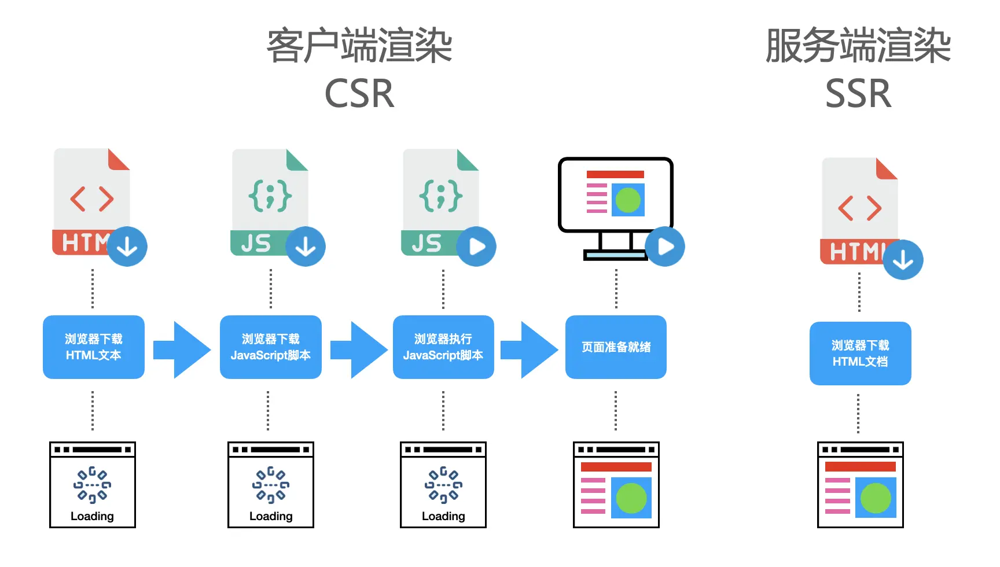
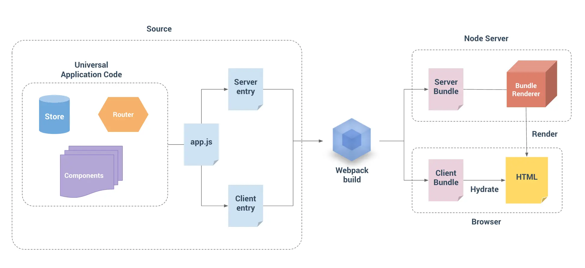
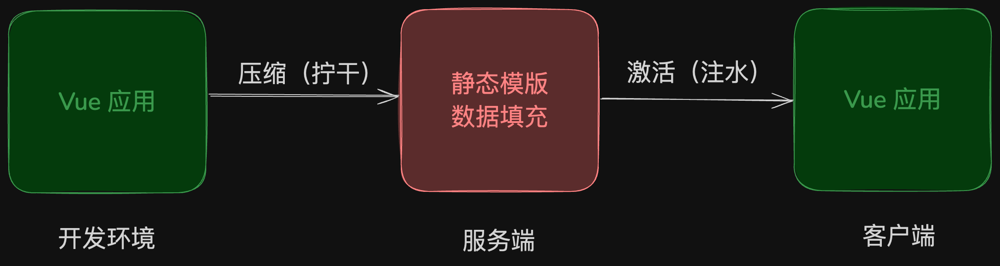
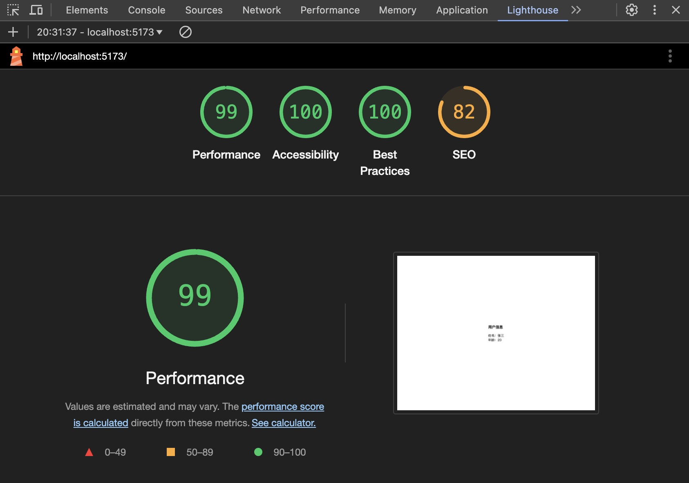

---
# You can also start simply with 'default'
theme: default
# random image from a curated Unsplash collection by Anthony
# like them? see https://unsplash.com/collections/94734566/slidev
# background: https://cover.sli.dev
# some information about your slides (markdown enabled)
title: SSR
# apply unocss classes to the current slide
class: text-center
# https://sli.dev/features/drawing
drawings:
  persist: false
# slide transition: https://sli.dev/guide/animations.html#slide-transitions
transition: slide-left
# enable MDC Syntax: https://sli.dev/features/mdc
mdc: true
# take snapshot for each slide in the overview
overviewSnapshots: true
---

<h1 class="slide-title">服务端渲染（SSR）</h1>

---
transition: fade-out
---

# Server-Side Rendering

---
transition: fade-out
---

# SSR 介绍

服务端渲染（Server-Side Rendering，简称SSR），就是在浏览器请求页面URL的时候，服务端将我们需要的HTML文本组装好，并返回给浏览器，这个HTML文本被浏览器解析之后，不需要经过 JavaScript 脚本的执行，即可直接构建出完整的 DOM 树并展示到页面中。这个服务端组装HTML的过程，叫做服务端渲染。

<v-click>

它与传统的客户端渲染（Client-Side Rendering，CSR）相对立，SSR通过在服务器端生成并提供HTML，有助于提升**Web应用的性能、搜索引擎优化（SEO）** 以及用户体验。

在哪端完成填充数据，就是哪个端的渲染。

 

</v-click>

<v-click>

- 性能提升：
  更快的首屏加载，服务端渲染的 HTML 无需等到所有的 JavaScript 都下载并执行完成之后才显示，所以你的用户将会更快地看到完整渲染的页面。
  
- 更好的SEO：
  (google、bing) 搜索引擎爬虫可以直接看到完全渲染的页面。

</v-click>

---
transition: fade-out
---

# SSR 必要吗

<v-click>

先说结论：不必要
</v-click>

<v-clicks>

- CPU消耗大：相当于将大部分的DOM操作都放在服务端进行，需要消耗更多的服务器CPU资源，尤其是对于高并发的网站。

- 增加复杂度：对于使用`Vue`、`React`开发的单页应用，需要额外处理SSR逻辑实现与部署环境。

- 首屏提升有限：客户端渲染的应用也能通过一定手段进行优化。
</v-clicks>

所以，现阶段使用SSR主要是用来解决 SEO

---
transition: fade-out
---

# SSR 示例

<TwoCols :cols="[
    { name: 'JSP（java）', img: 'jsp.png' },
    { name: 'PHP', img: 'php.png' }
  ]">
</TwoCols>

服务端渲染（SSR）不是一个新技术

<!--
JSP：大概8-10年前，盛行一种古老的前端开发模式，前端开发好静态界面(html+css)，发给后端改造成jsp然后填动态请求数据。所以，那时候前端也被叫【切图仔】
PHP: 不必多说，PHP世界第一！
-->

---
transition: fade-out
---

# SSR 心路历程

<v-click>

随着网页应用日益复杂，推动着Ajax、Vue、React等前端技术的高速发展，衍生出的前后端分离的开发模式更是大大提高了前端开发效率，导致这些老旧的技术开始慢慢退出舞台。
</v-click>

<v-click>

问题：
 
 
怎样使用单页应用框架（Vue、React）来实现服务端渲染？

</v-click>

---
transition: fade-out
---

# SSR 实现（Vue3）

[Vue SSR 官方文档：https://cn.vuejs.org/guide/scaling-up/ssr.html](https://cn.vuejs.org/guide/scaling-up/ssr.html)

<v-click>

</v-click>

---
transition: fade-out
---

# Client Hydration（客户端激活）

这个步骤也叫：注水、水合，是SSR中非常关键的一个步骤。

因为服务端只能组装数据生成静态的HTML模版（非真正DOM），注水就是将静态的HTML模版在客户端渲染再将其中各个DOM的事件对应绑定起来。它让客户端的应用变得可交互。

 

---
transition: fade-out
---

# SSR 应用框架

- Vue
  
  - [Nuxt：https://nuxt.com.cn/](https://nuxt.com.cn/)

- React
  
  - [Next.js：https://nextjs.org/](https://nextjs.org/)

---
transition: fade-out
---

# SEO 检查

Google Chrome - Lighthouse

---
transition: fade-out
---

# SEO 检查

- SEO测试工具

  - bing：[webmaster tools - https://www.bing.com/webmasters/about](https://www.bing.com/webmasters/about?setlang=zh-cn)
  
  - google chrome：[google search central - https://developers.google.cn/search](https://developers.google.cn/search)
  
  - baidu：[baidu seo - https://seo.baidu.com](https://seo.baidu.com)

---
transition: fade-out
layout: center
class: text-center
---

# Thank You
